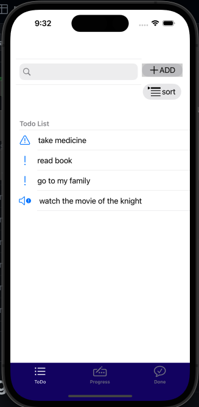
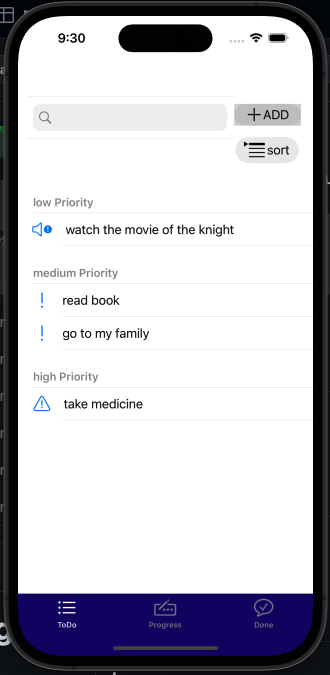
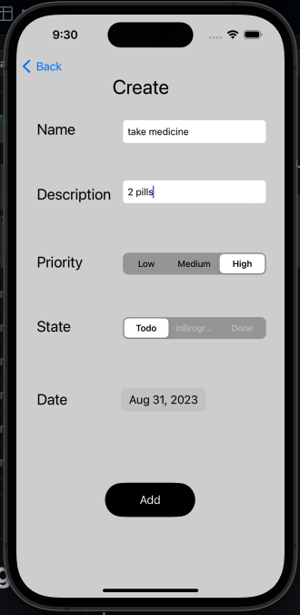
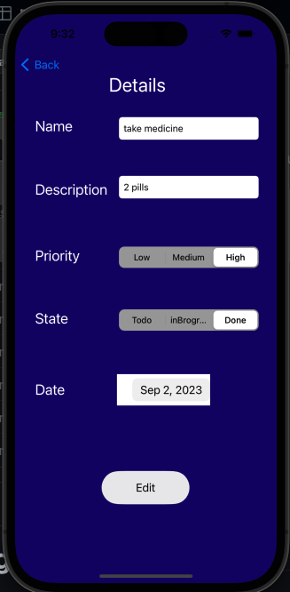
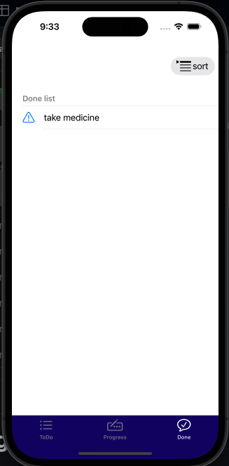
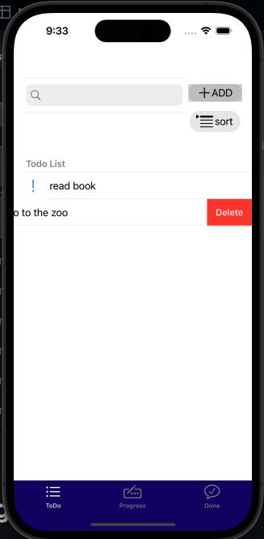

# TODO App
it's the final project of IOS using objective c  at ITI

Its an app that allow the users to make todo list 

## Features
 - [x] you can add a Todo list task 
 - [x] you can Edit your task any time 
 - [x] you can set priority(high low middle ) and state(todo progress done)
 - [x] you can delete any task you want
 - [x] you can sort the todo list according to the priority

## vedio Demo : 

## screenshots:

